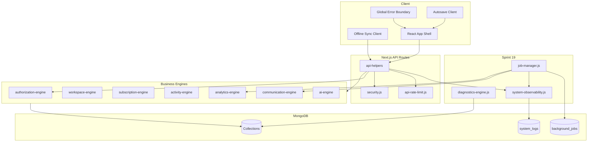

# DentOS — System Architecture Diagram (Sprint 19)

## Engine Dependency Map



## Collections (Sprint 19 Additions)

| Collection | Purpose |
|------------|---------|
| `system_logs` | Centralized observability |
| `background_jobs` | Job queue and status |
| `api_rate_limits` | API abuse protection |

## API Map (Sprint 19)

| Endpoint | Auth | Purpose |
|----------|------|---------|
| `GET /api/system/health` | Clinic user | Clinic system health |
| `GET /api/system/diagnostics` | Clinic user | Clinic diagnostics |
| `GET /api/platform-admin/monitoring` | Platform admin | Enterprise monitoring |
| `GET /api/platform-admin/backup` | Platform admin | Backup status |
| `GET /api/platform-admin/diagnostics` | Platform admin | Platform diagnostics |
| `GET /api/cron/jobs` | CRON_SECRET | Background job processor |

## Indexes

Run after deploy:

```bash
node scripts/run-indexes.js
```

Sprint 19 indexes are defined in `lib/setup-indexes.js` under "Sprint 19 collections".
